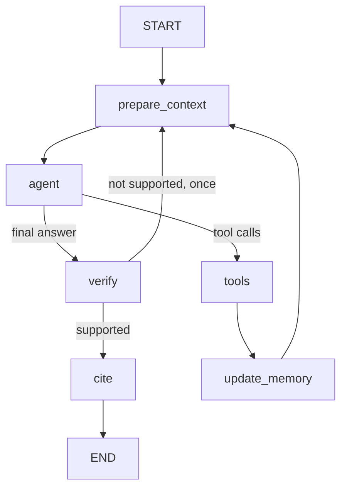

# EO scene agent

A conversational agent that finds Sentinel-2 scenes ("which images exist for place X, between dates Y and Z, with low cloud cover?") and answers follow-up questions about the results. Built with LangGraph, served with FastAPI, and calling its tools through an MCP server that queries a public STAC catalogue and a geocoding API. The model is open-weight (Gemma through Ollama).

```
user ──HTTP──> FastAPI ──> LangGraph agent ──MCP over HTTP──> MCP server ──> Earth Search STAC (scenes)
                               │                                       └──> Open-Meteo (geocoding)
                               └──> open-weight model (Gemma, through Ollama)
```

## 1. Run it

Python 3.11 or newer. Dependencies are pinned with exact versions in `pyproject.toml`.

```bash
git clone https://github.com/Oenarion/EO_agent.git && cd EO_agent
python -m venv .venv
```

Activate it (`source .venv/bin/activate`, or `.venv\Scripts\Activate.ps1` on Windows), then:

```bash
pip install -e ".[dev]"
cp .env.example .env        # Windows: copy .env.example .env
python -m pytest -q         # offline, about 20 seconds
```

**Model.** `gemma4:31b-cloud` through Ollama. Install Ollama and run `ollama signin` once. No API key. `.env.example` already holds these values. This is the only setup I tested.

**Start the two processes**, each in its own terminal with the environment active:

```bash
python -m eo_agent.mcp_server.server                        # MCP server on http://127.0.0.1:8001/mcp
python -m uvicorn eo_agent.api.main:app --port 8000         # API
```

**Demo.** One session, three turns (a question that needs tools, a follow-up that needs the kept context, a forced tool error), then the trace is printed so it can be matched to the three replies:

```bash
python demo/run_demo.py
```

For free chat use `python demo/chat.py`. Commands: `/language <code>` sets the language of place names (`en`, `it`, `es`, `fr`, `de`; default `en`), `/trace` prints the trace of the session, `/memory` shows the working memory and summary, `/new` starts a new session, `/quit` leaves. A trace can be printed again with `python -m eo_agent.observability.pretty <session_id>`.

To see the skill at work (needs the MCP server): `python demo/skill_demo.py`. It runs one question without and with the skill, and prints the tools called and the answer of each.

**Example traces** (in `traces/`, made with the model above):

| File | What it shows |
| --- | --- |
| `normal.jsonl` | A search over Ravenna and a follow-up question |
| `error.jsonl` | The 3-turn demo, with the forced tool error in turn 3 |
| `context_policy.jsonl` | A 15-turn run with low thresholds (`MAX_WINDOW=4 SUMMARY_TRIGGER=8`), with summaries. Produced by `python demo/run_context_demo.py` against an API started with those two variables |

A shortened real session (from `error.jsonl`):

```
you>   Find Sentinel-2 scenes over Ravenna, Italy in July 2025 with less than 10% cloud cover.
agent> I found 5 scenes ... 1. S2C_32TQQ_20250731_0_L2A | 2025-07-31 | cloud 1.40% ...  (then a Sources block with links)
you>   Give me the details of the second one.
agent> Details for S2A_32TQQ_20250723_0_L2A: acquired 2025-07-23, cloud cover 2.44%, sun elevation 62.49 degrees ...
you>   Now give me the details of scene S2X_DOES_NOT_EXIST.
agent> I tried to retrieve the details for S2X_DOES_NOT_EXIST, but it failed: no scene with that ID exists.
```

Settings are environment variables (see `.env.example`): model, `MCP_URL`, and the context limits `MAX_WINDOW` (8), `SUMMARY_TRIGGER` (12), `SUMMARY_MAX_CHARS` (1200), `MAX_TOOL_CHARS` (6000), `MAX_STEPS` (6).

## 2. The graph



- **`prepare_context`**: applies the context policy and builds the exact model input. Runs on every pass of the loop.
- **`agent`**: calls the model with the MCP tools bound. Tool calls go to `tools`; text is the final answer.
- **`tools`**: runs each tool through a real MCP client (`langchain-mcp-adapters`). Nothing is imported from the server. A failure becomes an error message for the model, never an exception.
- **`update_memory`**: plain code. Reads the tool results and updates the working memory (place, dates, cloud range, numbered results, selected scene, scene links).
- **`verify`**: plain code. Checks scene ids, dates, percentages and degrees in the answer against the tool results and memory. If something is unsupported, the model rewrites the answer once; if it is still unsupported, a visible warning is added.
- **`cite`**: plain code. Adds a `Sources` block with a catalogue link for each scene the answer cites.
- **Skill**: `skills/scene-selection/SKILL.md`, with `name` and `description` in its frontmatter. Only the name and the one-line description are in the system prompt. The model decides when to load it: if the request matches the description (a question such as "which scene should I use?"), it calls the local `load_skill` tool and receives the full instructions. Otherwise nothing is loaded, so the skill costs nothing on other turns, and on the next turn the context policy replaces its text with a one-line stub. With the skill, the agent reads the sun elevation of the three clearest scenes and answers with a short list with reasons and the limit of the cloud figure, instead of naming "the best scene". `python demo/skill_demo.py` asks the same question without and with the skill: without it, one scene is called the best with no caveat; with it, there are three candidates with reasons and the caveat. The evaluation checks that the skill is loaded for a choice question and not for a plain search or the details of one scene.
- **Loop stop**: the model answers without tool calls, or `MAX_STEPS` tool passes are reached (then the model is called without tools and told to answer with what it has).
- **Checkpointer**: `InMemorySaver`, with `thread_id` equal to the API session id. Sessions are lost when the API restarts (the trace files stay on disk). To survive a restart I would use `SqliteSaver` (one process) or `PostgresSaver` (several processes), a change in `AgentRuntime` with the same `thread_id`.

## 3. Context policy

**Stored per session:** the messages (each tool message capped at `MAX_TOOL_CHARS`, applied after the working memory has read the full result), the working memory (exact, kept by code), and a summary of older turns written by the model (at most `SUMMARY_MAX_CHARS`).

**Sent to the model on every call:** the system prompt, a "session memory" block rendered from the working memory and the summary, and only the last `MAX_WINDOW` messages, extended back to the start of a turn so a tool call is never separated from its result. Tool results from earlier turns are replaced by one line (for example `search_scenes: 5 of 5 scenes returned for 2025-07-01..2025-07-31, cloud 0.0-10.0%`).

**How it is bounded:** above `SUMMARY_TRIGGER` stored messages, the oldest whole turns are folded into the summary with one short model call and removed from the state. The turn in progress is never touched. If the summary call fails, a fixed template is used. A reference such as "the second one" still works after its messages are gone because the numbered list lives in the working memory.

**Demonstrated** in `traces/context_policy.jsonl`: 15 turns with `MAX_WINDOW=4`, `SUMMARY_TRIGGER=8`. Without the policy the history would reach 52 messages. With it, the session ended with 4 stored messages, never had more than 9 stored at a model call, and made 8 summary calls. The last question (about the first search, long gone from the window and the working memory) was answered correctly from the summary.

Limits: the summary is text written by a model and can be wrong, which is why exact facts are kept in the working memory. When a new search replaces the working memory, older results survive only in the summary.

## 4. Error behaviour

A failing tool never crashes the process, and the user gets a reply that says what was attempted and that it failed.

1. A tool fails either with an MCP `isError` (unknown scene id, bad date, area too large) or with an exception (connection refused, timeout). The `tools` node catches both and passes the model a message with the tool, arguments and cause.
2. The model explains the failure in one or two sentences. If it returns nothing, a fixed template is used: `I tried to call <tool> with <arguments> and it failed: <reason>.`
3. The failure is logged at ERROR level with session id, tool, arguments and error: `ERROR [session=error] eo_agent.agent: tool=get_scene_details args={"scene_id": "S2X_DOES_NOT_EXIST"} error=...[not_found]...`
4. The API answers HTTP 200, because the user got an answer. Only unexpected failures are 5xx (503 if the language model is unreachable, 500 for an internal bug). The API keeps running.
5. If the MCP server is down, the API still starts, chats get a fixed explanatory reply, and the connection is retried on the next request.

MCP tools retry transient failures (timeout, 5xx) once; validation and not-found errors are not retried.

**How each case was tested**

| Case | Offline test (no network, no model) |
| --- | --- |
| MCP `isError` (unknown scene id, bad input) | `tests/test_error_path.py` and `tests/test_mcp_tools.py`
| The call itself raises (connection refused, timeout) | `tests/test_error_path.py`, with a tool that raises
| HTTP 5xx or timeout from an external API, and the single retry | `tests/test_mcp_tools.py`
| MCP server down at start, and recovery on the next request | `tests/test_error_path.py`
| Language model unreachable (503), bug in the code (500) | `tests/test_error_path.py`
| The error is logged with session id, tool and error | `tests/test_error_path.py`

## 5. Traces

Every request appends JSON lines to `traces/<session_id>.jsonl`, all with the same fields: `ts, session_id, turn, event, node, tool, args, duration_ms, error, result_summary, final_answer, data`. Events: `request_start`, `node`, `llm_call` (with token counts), `tool_call`, `request_end` (the final answer, identical to the API reply). It is a LangChain callback handler plus a `contextvar` for the session id, so node and tool code do not know about tracing. API keys are redacted.

## 6. MCP server

`src/eo_agent/mcp_server/`, built with FastMCP, over streamable HTTP (stdio also available with `--transport stdio`). Outputs are typed and compact, inputs are validated before any network call, errors are typed (`invalid_input`, `not_found`, `upstream_error`).

| Tool | External API | Returns |
| --- | --- | --- |
| `geocode_place(name, language)` | Open-Meteo geocoding | Up to 3 candidates with a bbox of about 10 km. The language is a session setting applied by code |
| `search_scenes(bbox, start_date, end_date, max_cloud_cover, min_cloud_cover, limit)` | Earth Search STAC, `sentinel-2-l2a` | Numbered scenes, clearest first, with a catalogue link. If empty, `empty_reason` says why and gives the closest dates |
| `get_scene_details(scene_id)` | Earth Search STAC | Date, cloud cover, tile, satellite, sun elevation, footprint, band names. Unknown id gives `not_found` |

The cloud percentage in the catalogue (`eo:cloud_cover`) is for the whole tile (about 113 km wide), not for the requested area. I measured differences of up to 30 points on real data, so the agent reports it as the tile figure and says so. There is no default cloud filter.

The geocoder matches towns, cities and villages. A country or region name ("Italy", "Lombardia") matches a small place with that name, possibly in another country. The agent searches with it and always says which place it used ("I used Lombardia, Michoacan, Mexico"), so a wrong match is visible. Giving coordinates or a bounding box skips the geocoder.

## 7. HTTP API

| Endpoint | Purpose |
| --- | --- |
| `POST /chat` | `{"session_id", "message", "language"?}` returns `{session_id, reply, turn, tool_calls}` |
| `GET /traces/{session_id}` | The trace events of a session |
| `GET /sessions/{session_id}/memory` | Working memory, summary, stored message count |
| `GET /health` | Status, whether the tools are loaded, model, context thresholds |

Docs at `http://127.0.0.1:8000/docs`.

## 8. Evaluation

`python -m evals.run_eval --repeat 3` runs 31 scripted cases (real model, real MCP tools, one fresh session per case) and checks them with plain code, with no model as judge: no scene id that a tool did not return, the right tool with the right arguments, errors reported, scope and prompt-injection cases, and the order of the tool calls.

Last run (`evals/last_run.json`, model `gemma4:31b-cloud`, 3 runs per case): 93 of 93 cases, 618 of 618 checks.

How far to trust it:
- The cases and the checks were written by me, and I did not read every reply by hand. A check can be wrong in both directions (accept a bad reply, or reject a good one). It happened twice: two checks were too narrow and I corrected them. The checks are unit-tested in `tests/test_eval_checks.py`, which shows they behave as written, not that they measure the right thing.
- I tuned the prompt on these same questions, so the score is biased upwards. Read it as a regression suite that shows the behaviour holds, not as an independent measure of quality.
- One model, 3 runs per case, and the model is not deterministic: a case that passes 3 times can still fail on the fourth.
- Problems that mattered most were found by chatting by hand, not by the suite, and then added as cases.

## 9. What I left out, and future work

**Evaluation and testing**
- **An independent evaluation.** The evaluation in section 8 is made of checks that I wrote, on cases that I wrote, and the prompt was tuned on the same cases. No model judges the quality of an answer (is it helpful, is it faithful to the tool results, is the tone right), and nobody else has written questions. TODO: add a model as a judge that scores each answer against a short rubric (grounded in the tool results, answers the question, says what it does not know), ideally a different model from the one under test so that it does not grade itself, and check a sample of its scores by hand. Also add a set of questions written by someone who has not seen the prompt, and run each case more times to measure how often it fails.
- **Other models.** Only Gemma through Ollama was tested. TODO: run the same evaluation on a second open-weight model.
- **Tests of the outside edges.** The offline tests cover the graph, the tools and the API, but not the model factory, the loading of the MCP tools or the start of the server (they were only checked by running the project). TODO: add a test with a fake model server and an in-process MCP server.

**Product**
- **Cloud cover over the requested area.** The catalogue figure is for the whole tile, and I measured differences of up to 30 points on real data. Measuring it over the area is feasible: the scene classification band of the same scene (public files on AWS) can be read only in a window around the box, about 0.8 s per scene. A picture of the area would come from the true-colour band of the same scene, cropped to the box. The catalogue `preview.jpg` cannot be used, because it covers the whole 113 km tile at about 330 m per pixel. Both need raster libraries, so I kept them out. TODO: show the area figure next to the tile figure, with the picture.
- **Places.** When several places share a name (Springfield), the agent uses the most populous one and says which one it used. TODO: list the candidates, with the region and country that the geocoder already returns, and let the user choose. Country and region names (see section 6) need a different geocoder, because this one only knows towns and villages. A large region would also have to be split into several searches, because one search is limited to 2 degrees per side.
- **More tools.** The agent has three tools: find a place, search scenes, scene details. TODO: add two tools: an estimate of the next time Sentinel-2 passes over a tile, and a vegetation index (NDVI, from the red and near-infrared bands) for a scene.
- **Prompts in other languages.** Prompts are in English. The model can answer in other languages, but I did not test whether those answers are as trustworthy and robust as in English.

**Robustness and operation**
- **Memory of older searches.** The working memory keeps only the latest search, so the exact figures of an older search survive only in the summary, which is text written by a model and can drop or change numbers. TODO: keep a short structured history in the working memory (the last 5 searches: place, dates, cloud filter, scene ids and cloud cover), written by code, so that old figures stay exact and the summary only has to remember what the user wanted. The list of scene links should also be limited to the scenes of those searches: today it grows with every search of the session.
- **Cleaning of old sessions.** The checkpointer keeps one checkpoint (a full copy of the state) for every step of the graph and never deletes one, so the memory of the process grows with the number of turns, even though the context sent to the model is bounded. TODO: delete old checkpoints of a session, and expire idle sessions.
- **Persistent sessions.** See the checkpointer in section 2. The counters and locks kept per session in memory also never expire, so a long-running process needs an expiry.
- **Authentication, rate limiting, timeouts.** The API is a local service: anyone who can reach it can use it, and every request costs a call to the model. Tool calls use the default timeouts of the MCP client, which can be as long as 5 minutes, so a tool that hangs would block the turn. TODO: add an API key (who may call) and a limit per client (how many calls), set an explicit timeout on every tool call, and add a health check that pings the MCP server, because `/health` only says that the tools were loaded.
- **A weaker point of the verification.** It checks that the ids, dates and numbers of an answer exist in the facts of the conversation, not what the sentences around them mean. A percentage written without decimals, such as "10%", is accepted if any number from 9.5 to 11 appears anywhere in the facts, for example "10 scenes found", so a wrong cloud cover could pass. Percentages with decimals are much harder to match by chance, and a percentage on the same line as a single scene id is compared with that scene. TODO: compare percentages only with cloud cover values. The summary of old turns is text written by a model and also counts as a fact. TODO: stop trusting it for numbers.
- **Streaming of replies, multi-agent delegation (A2A).** Not attempted.

## 10. Layout and data sources

```
src/eo_agent/
  config.py, llm.py          settings, model factory
  mcp_server/                server.py, stac.py, geocode.py, http.py, schemas.py
  agent/                     graph.py, state.py, context.py, verify.py, citations.py, skills.py,
                             errors.py, prompts.py, runtime.py, mcp_client.py
  api/main.py                FastAPI app
  observability/             tracing.py, pretty.py
skills/  demo/  evals/  tests/  traces/
```

Scenes: Sentinel-2 L2A from the [Earth Search](https://earth-search.aws.element84.com/v1) STAC API (free, no key). Geocoding: [Open-Meteo](https://open-meteo.com/) (CC BY 4.0, non-commercial free tier). Both are called with a custom User-Agent, timeouts and at most one retry.
