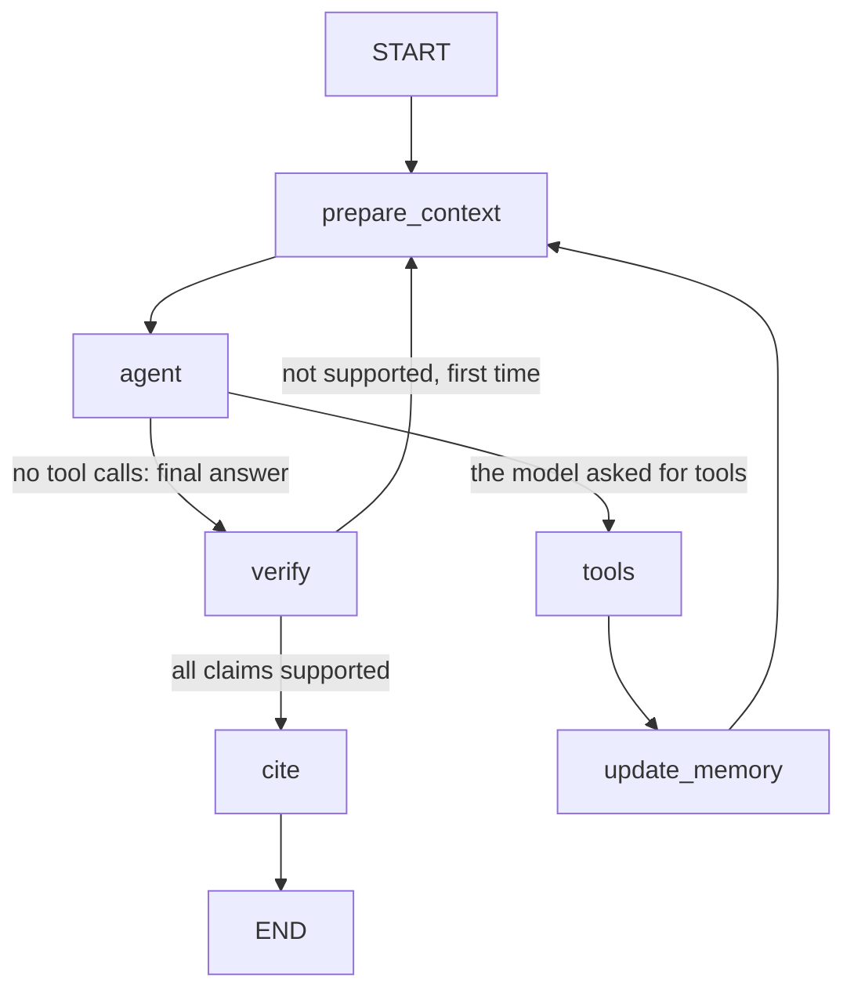

# EO scene agent

A conversational agent for exploring Sentinel-2 satellite imagery. Ask in plain language which scenes exist for a place and a period, with a cloud cover limit, then keep asking about the results (for example "details of the second one"). It is built with LangGraph, calls its tools through an MCP server that queries a public STAC catalogue and a geocoding API, and is served over HTTP with FastAPI. Answers are grounded in what the tools returned, checked before they are sent, and every scene they cite is linked to its catalogue record.

```
user ──HTTP──> FastAPI ──> LangGraph agent ──MCP over HTTP──> MCP server ──> Earth Search STAC (scenes)
                               │                                       └──> Open-Meteo (geocoding)
                               └──> open-weight model (Gemma, through Ollama)
```

A real session (from `traces/error.jsonl`, shortened):

```
you>   Find Sentinel-2 scenes over Ravenna, Italy in July 2025 with less than 10% cloud cover.
agent> I found 5 Sentinel-2 scenes for Ravenna, Emilia-Romagna, Italy in July 2025 with less than 10% cloud cover:
       1. S2C_32TQQ_20250731_0_L2A | 2025-07-31 | cloud 1.40%
       2. S2A_32TQQ_20250723_0_L2A | 2025-07-23 | cloud 2.44%
       ...                                     (followed by a Sources block with a link per scene)

you>   Give me the details of the second one.
agent> Here are the details for scene S2A_32TQQ_20250723_0_L2A: acquired 2025-07-23, cloud cover 2.44%,
       Sentinel-2A, sun elevation 62.49 degrees, ...

you>   Now give me the details of scene S2X_DOES_NOT_EXIST.
agent> I tried to retrieve the details for scene S2X_DOES_NOT_EXIST, but it failed because no scene with that ID
       exists in the catalogue.
```

## Contents

1. [Quick start](#1-quick-start)
2. [How it works](#2-how-it-works): [the graph](#the-graph), [context policy](#context-policy), [verification](#verification-of-the-answers), [errors](#error-behaviour), [skill](#skill-choosing-a-scene), [place name language](#language-of-place-names), [traces](#traces)
3. [MCP tools](#3-mcp-tools)
4. [HTTP API](#4-http-api)
5. [Persistence](#5-persistence)
6. [Evaluation](#6-evaluation)
7. [What I left out, and what is next](#7-what-i-left-out-and-what-is-next)
8. [Repository layout](#8-repository-layout)
9. [Data sources and terms](#9-data-sources-and-terms)

## 1. Quick start

Python 3.11 or newer. Dependencies are pinned with exact versions in `pyproject.toml`.

**Install**

```bash
git clone https://github.com/Oenarion/EO_agent.git && cd EO_agent
python -m venv .venv
```

Activate the environment: `source .venv/bin/activate` (Linux, macOS) or `.venv\Scripts\Activate.ps1` (Windows PowerShell). Then:

```bash
pip install -e ".[dev]"
cp .env.example .env        # Windows: copy .env.example .env
```

**Model.** The agent uses an open-weight model through Ollama: `gemma4:31b-cloud`, a cloud-hosted model, so Ollama must be installed and you need to run `ollama signin` once. There is no API key. `.env.example` already has these values, so copying it to `.env` is enough. This is the only setup I have tested, and the one that made every trace and result below. The `.env` file is never committed.

**Run the tests** (offline, about 20 seconds, no model and no network):

```bash
python -m pytest -q
```

**Start the two processes**, each in its own terminal with the environment active:

```bash
python -m eo_agent.mcp_server.server
```

```bash
python -m uvicorn eo_agent.api.main:app --port 8000
```

The MCP server listens on `http://127.0.0.1:8001/mcp` (change it with `MCP_URL`). After any change to the tools, restart the MCP server: the agent reads the tool schemas when it first connects.

**Try it.** The quickest way is the interactive chat. It starts with a short introduction (what the agent does, the language of place names, a note on the cloud figure) and has the commands `/language`, `/trace`, `/memory`, `/new` and `/quit`:

```bash
python demo/chat.py
```

The demo runs one session of three turns (a question that needs tools, a follow-up that relies on the previous answer, a forced tool error) and then prints the trace, so it can be matched to the three replies:

```bash
python demo/run_demo.py
```

The trace of every session is also written to `traces/<session_id>.jsonl`, and can be printed again with `python -m eo_agent.observability.pretty <session_id>`.

**Other demos**

| Command | What it shows | Needs |
| --- | --- | --- |
| `python demo/run_context_demo.py` | A 15 turn conversation, with the size of every model call: how the context stays bounded | MCP server and an API started with low thresholds (below) |
| `python demo/skill_demo.py` | The same question without and with the skill | MCP server |
| `python demo/verify_demo.py` | The verification catching an answer that was damaged on purpose | MCP server |
| `python demo/mcp_smoke.py` | Every MCP tool called directly through an MCP client, errors included | MCP server |
| `python demo/local_chat.py "q1" "q2"` | The agent in one process, without the API | MCP server |
| `python -m evals.run_eval --repeat 3` | The evaluation (section 6) | MCP server |

The context demo needs low thresholds in the API so that the policy triggers early. Restart the API like this:

```powershell
$env:MAX_WINDOW="4"; $env:SUMMARY_TRIGGER="8"; python -m uvicorn eo_agent.api.main:app --port 8000
```

```bash
MAX_WINDOW=4 SUMMARY_TRIGGER=8 python -m uvicorn eo_agent.api.main:app --port 8000
```

**Example traces** (made with the model above) are in `traces/`:

| File | What it shows |
| --- | --- |
| `traces/normal.jsonl` | A normal run: a search over Ravenna and a follow-up question |
| `traces/error.jsonl` | The 3-turn demo, with the forced tool error in turn 3 |
| `traces/context_policy.jsonl` | The 15-turn run with `MAX_WINDOW=4`, `SUMMARY_TRIGGER=8`, including summaries |

**Configuration** (environment variables or `.env`):

| Variable | Value in `.env.example` | Meaning |
| --- | --- | --- |
| `LLM_PROVIDER`, `LLM_MODEL` | `ollama`, `gemma4:31b-cloud` | The model. `LLM_BASE_URL` and `LLM_API_KEY` stay empty with Ollama |
| `MCP_URL` | `http://127.0.0.1:8001/mcp` | Where the agent finds the MCP server (and where the server listens) |
| `MAX_WINDOW` | 8 | Messages sent to the model at most (extended back to the start of a turn) |
| `SUMMARY_TRIGGER` | 12 | Stored messages above which older turns are summarized |
| `SUMMARY_MAX_CHARS` | 1200 | Length limit of the summary |
| `MAX_TOOL_CHARS` | 6000 | Length limit of a stored tool message |
| `MAX_STEPS` | 6 | Tool passes per turn |
| `MAX_VERIFY_RETRIES` | 1 | Rewrites asked of the model when verification fails |
| `TRACE_DIR` | `traces` | Where the trace of each session is written |
| `SKILLS_DIR` | the `skills/` folder | Where skills are found; an empty value turns skills off |

## 2. How it works

### The graph



- **`prepare_context`** applies the context policy and builds the exact input for the model: system prompt, session memory block, the recent messages. It runs on every pass of the loop.
- **`agent`** calls the model with the three MCP tools bound (and `load_skill`, see the skill section). If the model returns tool calls, the graph goes to `tools`. If it returns text, that is the final answer.
- **`tools`** runs each requested tool through a real MCP client (`langchain-mcp-adapters`). Nothing is imported from the server: the agent only sees what the server publishes over HTTP. Any failure becomes an error message for the model.
- **`update_memory`** is plain code, with no model call. It reads the tool results of this pass and updates the working memory: the place, dates and cloud range of the last search, the numbered list of results, the selected scene, and the catalogue links of every scene seen.
- **`verify`** is plain code too: it checks the final answer against the facts of the conversation. If something is not supported, the answer is removed and the model is asked, once, to write it again.
- **`cite`** is plain code too. It adds a `Sources` block to the final answer: for each scene id the answer cites and that a tool really returned, a link to its catalogue record and to its preview (links the model never has to copy, so they cannot be mistyped), plus the data attribution. An id that no tool returned gets no link.
- **Where the loop stops.** It ends when the model answers without tool calls. A safety limit, `MAX_STEPS` tool passes per turn, also ends it: once reached, the model is called without tools and is told to answer with what it has and to say that it stopped.
- **Persistence of the conversation.** The graph is compiled with a checkpointer (`InMemorySaver`), and the `thread_id` is the API session id. See the persistence section for what to use after a restart.

### Context policy

A follow-up has to be able to depend on earlier turns without the user repeating anything. The policy has three parts.

**What is stored per session** (the checkpoint):
- the messages, with every tool message capped at `MAX_TOOL_CHARS` characters. The cap is applied after the working memory has read the full result;
- the **working memory**: place, date range, cloud filter, the numbered results of the latest search, the selected scene. Plain code keeps it up to date, so it is exact;
- a **summary** of older turns, written by the model, at most `SUMMARY_MAX_CHARS` characters.

**What is sent to the model on every call:**
- the system prompt, then a "session memory" block rendered from the working memory and the summary;
- only the last `MAX_WINDOW` messages, extended backwards to the start of a turn, so a tool call is never separated from its result;
- tool results from earlier turns are replaced by one line, for example `search_scenes: 5 of 5 scenes returned for 2025-07-01..2025-07-31, cloud 0.0-10.0%`. The raw JSON is only sent in the turn that asked for it.

**How it is bounded.** When more than `SUMMARY_TRIGGER` messages are stored, the oldest whole turns are folded into the summary with one short model call and removed from the state. The turn in progress is never touched. If the summary call fails, a deterministic template is used instead and the turn goes on. Tool outputs are also compact by design (the MCP tools never return raw STAC items). The history of raw tool payloads is therefore never unbounded.

Why a reference such as "the second one" still works after its messages are gone: the numbered list lives in the working memory, not in the history. Information about older searches survives in the summary.

Each model call records its size in the trace (`prepare_context` node events and `llm_call` events): messages stored, messages sent, characters sent, tokens when the provider reports them, and whether it summarized.

**Proof.** `demo/run_context_demo.py` ran 15 turns with `MAX_WINDOW=4`, `SUMMARY_TRIGGER=8` (trace: `traces/context_policy.jsonl`). Without the policy the history would have reached 52 messages. With it, the session ended with 4 stored messages, never had more than 9 stored at any model call, and made 8 summary calls. The last question, about the first search over Ravenna (whose results had been replaced in the working memory by three later searches), was answered correctly from the summary:

```
turn  state  sent  chars  removed  question
   1      1     5   8281        0  Find Sentinel-2 scenes over Ravenna, Italy in July 2025 ...
   ...
  12      9     3   6776        8  Details of the last one, please.
  15      9     3   6174        6  Going back to the very first search, over Ravenna: ...
```

`state` is the number of stored messages when the turn starts, `sent` the messages in the last model call of the turn, `removed` the messages folded into the summary during the turn. The characters sent include the system message (the prompt, the skills index and the memory block), which is about 4,600 characters when the memory is empty and grows as it lists results; the tool descriptions travel separately and are not counted.

Known limits: the summary is text written by a model, so it can be wrong; facts that must be exact are also in the working memory. When a new search replaces the working memory, the older results exist only in the summary. The window can exceed `MAX_WINDOW` when one turn has many tool calls.

### Verification of the answers

The prompt asks the model not to invent anything, and the evaluation measures it offline, but nothing stopped a wrong value in a real answer. The `verify` node does, on every final answer, with plain code and no second model.

It looks in the answer for what can be checked: scene ids, dates (YYYY-MM-DD), percentages and degrees. Each must be supported by a fact of the conversation: a tool result, the working memory, the summary, an earlier answer, or something the user wrote. A percentage may differ from the number in the tool result only by rounding (1.402733 supports 1.40, 1.4 and 1). A percentage on a line with a single scene id must also be the cloud cover of that scene, so the number of one scene cannot be attached to another. Digits of ids and dates are not counted as numbers, so a "31%" is not supported by "2025-07-31".

If everything is supported, nothing changes and there is no extra model call. If not, the wrong answer is removed from the conversation and the model is told which values are not supported and asked to write the answer again, once (`MAX_VERIFY_RETRIES`). If the second answer is still unsupported, it stays, with a visible line: "Warning: I could not verify these values against the tool results: ...". The trace has a `verify` event with the verdict and the list of problems.

What it does not do: it checks that values exist and belong where they are written, not what the sentences around them mean. A number that the user writes in a question counts as a fact, so a false number repeated by the agent passes unless it is attached to a scene id. Counts such as "5 scenes" are not checked.

In the 87 runs of the evaluation the step never had to correct anything: the model did not write an unsupported value, and the verifier raised no false alarm. To show it working, `python demo/verify_demo.py` wraps the real model so that its first answer is damaged on purpose (a scene id and a percentage replaced by values no tool returned): the step finds both, the model writes the answer again, and the second answer passes with all 21 claims supported.

### Error behaviour

A failing tool never crashes the process, and the user always gets a reply that says what was attempted and that it failed.

1. A tool fails in one of two ways: the MCP server reports an error (`isError`: unknown scene id, bad date, bbox too large...), or the call itself raises (connection refused, timeout). The `tools` node catches both and gives the model a message with the tool name, the arguments and the cause. The turn continues.
2. The model writes the reply. The prompt asks for one or two sentences: what it tried, that it failed, why.
3. If the model returns an empty answer, a fixed template replaces it: `I tried to call <tool> with <arguments> and it failed: <reason>.`
4. The failure is logged at ERROR level with the session id, the tool, the arguments and the error, for example:
   `ERROR [session=error] eo_agent.agent: tool=get_scene_details args={"scene_id": "S2X_DOES_NOT_EXIST"} error=Error executing tool get_scene_details: [not_found] ...`
5. The API answers HTTP 200: the user got an answer. Only unexpected failures are 5xx (503 if the language model is unreachable, 500 for an internal bug). The API keeps running in all cases.
6. If the MCP server is down, the API still starts. Chats get a fixed reply that explains it, and the connection is retried on the next request, so restarting the MCP server is enough.

The MCP tools retry transient failures (timeout, 5xx) once. Validation and not-found errors are not retried. The agent itself does not retry.

`traces/error.jsonl` is the demo with the forced error: turn 3 asks for `S2X_DOES_NOT_EXIST`, the `tool_call` line has the error, and the reply explains it.

### Skill: choosing a scene

An Agent Skill is a folder with a `SKILL.md` file, with a `name` and a `description` in its header. This project has one, `skills/scene-selection/`. The system prompt carries only its name and its one-line description. The full instructions are loaded by a `load_skill` tool, only when the model decides that the request matches the description (a question such as "which scene should I use?"), so the skill costs nothing on the other turns, and the turn after it is loaded the context policy replaces the text with a one-line stub. Skills are discovered from the `skills/` folder. `load_skill` is a local tool of the agent: a skill is guidance for the model, not a data source, so it does not live in the MCP server.

What the skill does: the catalogue cannot say which scene is "the best", and its cloud figure is for the whole scene (see the note in the tools section), so the skill tells the agent never to name a winner. It searches, reads the details of the three clearest scenes to get the sun elevation, ranks them by stated criteria (cloud cover, closeness to the wanted date, sun elevation when cloud covers are close), answers with a short list with one line of reason each, and ends with the limit of the cloud figure and a suggestion to open the preview.

`python demo/skill_demo.py` asks the same question twice, without the skill and with it. Without it, the agent answers "the best scene to use is ..." and gives one scene with no caveat. With it, the agent loads the skill, reads the sun elevation of three scenes, gives three candidates with reasons and the limit. The evaluation checks both sides: the skill is loaded for a choice question, and it is not loaded for a plain search or for the details of one scene.

### Language of place names

The geocoding API matches a name in the language you ask for: "Copenhagen" is found in English, "Copenaghen" only in Italian, and "Roma" in English is a place in Lesotho, not the capital of Italy. So the language of place names is a **setting of the session**, English by default. In the chat it is changed with `/language <code>` (`en`, `it`, `es`, `fr`, `de`), and `/language` alone shows the current one. Over the API it is the optional `language` field of `POST /chat`, and the session keeps it until it is changed.

The setting is applied by code, not by the model: the `tools` node puts the session language into every `geocode_place` call. The memory block tells the model the current language and, when it was changed after the last place search, tells it to search the place again. When a place is not found, the agent says which language is in use and that it can be changed. The prompts stay in English: I have not tested how the model behaves with prompts in other languages.

### Traces

Every request writes JSON lines to `traces/<session_id>.jsonl`. All lines have the same fields:

`ts, session_id, turn, event, node, tool, args, duration_ms, error, result_summary, final_answer, data`

Events: `request_start`, `node` (each graph node), `llm_call` (including summary calls, with token counts), `tool_call` (arguments, duration, error), `request_end` (the final answer, identical to the API reply).

It is done with a LangChain callback handler attached to the graph run, plus a `contextvar` for the session id (the log lines get it from the same variable), so the node and tool code does not know about tracing. API keys are never written. `python -m eo_agent.observability.pretty <session_id>` prints a trace as a table grouped by turn, with the final answers.

## 3. MCP tools

The server (`src/eo_agent/mcp_server/`) uses FastMCP, as its own process. By default it is a service over streamable HTTP, which is what the agent uses. It also speaks stdio (`python -m eo_agent.mcp_server.server --transport stdio`), for MCP clients that start the server themselves. Tool outputs are typed (pydantic) and compact. Inputs are validated before any network call, and errors are typed: `invalid_input`, `not_found`, `upstream_error`.

| Tool | Inputs | External API | Returns |
| --- | --- | --- | --- |
| `geocode_place` | `name`, `language` (set by the system) | Open-Meteo geocoding | Up to 3 candidates (name, country, region, lat, lon, a bbox of about 10 km). The name is matched in one language, a setting of the session; exact name matches come first, then the most populous. `shares_name_with_others` marks an ambiguous name. No match is an empty list, not an error |
| `search_scenes` | `bbox` `[west, south, east, north]`, `start_date`, `end_date` (YYYY-MM-DD), `max_cloud_cover` (100), `min_cloud_cover` (0), `limit` (5, max 10) | Earth Search STAC, collection `sentinel-2-l2a` | Numbered scenes (id, datetime, cloud cover, tile, thumbnail, `record_url`), clearest first, `total_found`, `more_available`, the query actually used. Each side of the bbox is limited to 2 degrees. When nothing matches, `empty_reason` says why: scenes exist but with another cloud cover, or there is no acquisition in the period and these are the closest dates, each with its cloud cover and, if a cloud limit was given, only the dates that fit it |
| `get_scene_details` | `scene_id` | Earth Search STAC | Datetime, cloud cover, tile, satellite, sun elevation, footprint, thumbnail, band names, `record_url`. Unknown id gives `not_found` |

There is no cloud filter unless the user asks for one: the default range is 0 to 100, and the agent does not pass a limit that the user did not give. Each result also lists fields the API did not provide (`missing_fields`, `missing_data`), and the agent reports them at the end of its answer.

### A note on the cloud cover figure

The cloud percentage that the catalogue gives (`eo:cloud_cover`, the value used for every cloud filter and for the sorting) is computed over the **whole tile**, which is about 113 by 113 km, and not over the area that was asked for. The 10 km box around a city is less than 1% of it, so the figure can be far from the sky over that city.

I checked it on real data: for 40 scenes of one tile in June to August 2025, I compared the catalogue figure with the share of cloud pixels over a 10 km box near Ravenna, read from the per-pixel scene classification band (`SCL`) of each scene. The two differ by up to 30 points, in both directions: a scene at 13.5% on the tile was at 27.3% over the box, a scene at 33.3% on the tile was at 2.6% over the box, and the worst case was 37.5% against 82.6%. So a cloud filter can keep a scene that is cloudy over the area, or drop one that is clear. The agent reports the tile figure as it is, and the chat says so at the start. Measuring the cloud cover over the requested area is the first of the next steps (section 7).

## 4. HTTP API

| Endpoint | Purpose |
| --- | --- |
| `POST /chat` | Body `{"session_id": "...", "message": "...", "language": "it"}` (`language` is optional). Returns `{session_id, reply, turn, tool_calls: [{tool, args, ok}]}` |
| `GET /traces/{session_id}` | The trace events of a session |
| `GET /sessions/{session_id}/memory` | The working memory, the summary, the number of stored messages and the place name language |
| `GET /health` | Status, whether the tools are loaded, the model, the place name languages, the context thresholds |

The session id may contain letters, digits, `_`, `.` and `-` (up to 64 characters), because it is also a file name. Interactive docs: `http://127.0.0.1:8000/docs`.

## 5. Persistence

Sessions are kept in memory (`InMemorySaver`), so they are lost when the API process restarts. The trace files stay on disk. To survive a restart I would swap in a persistent LangGraph checkpointer: `SqliteSaver` (package `langgraph-checkpoint-sqlite`) for a single process, or `PostgresSaver` (`langgraph-checkpoint-postgres`) for several processes. It is a change in `AgentRuntime` and one dependency, with the `thread_id` unchanged. I did not do it because in-memory is enough here, and a database adds setup for whoever runs the project. The turn counter would then move into the graph state.

## 6. Evaluation

`evals/` has a small evaluation: 29 scripted questions (one to three turns each, a fresh session per case), checked by plain code. No model judges anything. The agent runs in the same process with the real model and the real MCP tools, so the MCP server must be running.

```bash
python -m evals.run_eval --repeat 3
```

Every case gets four generic checks: the session does not crash, every scene id in a reply appears in a tool result of that session (nothing invented), a failed tool is reported in the reply, and the verification step of the agent had nothing to correct. Each case then adds its own:

| Group | What the cases check |
| --- | --- |
| Tools and memory | The right tool with the right arguments (for example details of the second scene of the previous search), a value taken from memory without a tool call, a repeated request that keeps the dates and adds no cloud limit that the user did not give |
| Empty and unknown results | An empty search is reported as empty and explained (scenes exist with another cloud cover, or the closest dates within the user's limit), a place that does not exist is not searched, a missing field is declared |
| Places and language | An ambiguous place is named, a local name ("Roma", "Copenaghen") finds the right city with the Italian setting, a change of language triggers a new place search, a wrong language setting is explained |
| Errors and invalid input | An unknown scene id fails and the reply explains it, an area that is too large and an impossible date are handled |
| Citations | Every cited scene has a working record link in a Sources block, an empty search has none |
| Scope and prompt injection | A general question is not answered from the model's knowledge, a question about the agent's own tools is answered, a request for code, an order hidden in a real request and a request to repeat the instructions change nothing and reveal nothing |
| Skill | Loaded for a choice question and not for a plain search or for the details of one scene; the answer is a short list with the limit, not a winner |

The checks are themselves tested offline in `tests/test_eval_checks.py`.

Besides the answers, the evaluation measures the **path**: for 16 of the cases it declares which tool calls are expected, in which turn and in which order, with which arguments (the dates, the cloud range, the area, the scene id: checked on the facts, not on how the model wrote them). Four numbers come out of each run: the share of expected tools that were called, whether they came in the right order, the share called with the right arguments, and the calls beyond the expected ones. It is the idea of the step-by-step metrics of the Earth-Bench benchmark: a right answer reached by a wrong path is a warning sign.

Result of the last run (`evals/last_run.json`), model `gemma4:31b-cloud`, 3 runs of each of the 29 cases:

| | Passed |
| --- | --- |
| Cases | 87 / 87 |
| Checks | 579 / 579 |
| Groundedness | 111 / 111 |
| Tool use | 135 / 135 |
| Memory (follow-ups) | 39 / 39 |
| Empty and unknown results | 42 / 42 |
| Invalid input and tool errors | 96 / 96 |
| Disclosure (place used, missing data) | 18 / 18 |
| Scope and prompt injection | 21 / 21 |
| Citations (record links, attribution) | 12 / 12 |
| Skill (loaded when needed, not otherwise) | 18 / 18 |
| Verification had nothing to correct | 87 / 87 |

Trajectory over the same runs (48 runs with expected calls): tool coverage 100%, right order 100%, right arguments 100%, no extra calls, 48 of 48 perfect paths.

How to read these numbers. The first runs were not perfect (42 of 45 cases), and they found gaps in the system prompt, which I then fixed: the agent answered a general knowledge question from its own knowledge, in one run it silently changed an impossible date, and a manual test showed that it refused to explain its own tools. I tuned the prompt on these same questions, so the final score is not an independent test: it is a small regression suite that shows the behaviour holds, and it should grow with new questions. It covers one model and 3 runs per case, and the model is not deterministic.

What the suite did not find: manual testing in a chat found the problems that mattered most. The place language (an Italian name returned another place), a default cloud limit that nobody asked for (it hid a scene, and the agent then told the user they had asked for it), an empty result that was never explained, and a language change that the agent ignored because it reused an old result. All are now covered by cases, and the suite is only as good as the questions someone thought of.

## 7. What I left out, and what is next

**Left out, and why**
- **Cloud cover over the requested area, and a picture of the area.** Both add libraries (`rasterio`, `numpy`, `Pillow`) and reads from a server in the United States to a project that works, and I preferred a stable base. I did a feasibility test instead: the classification band is a Cloud Optimized GeoTIFF, so only the window over the box can be read, in about 0.8 seconds per scene; and a crop of the true-colour band with the box drawn on it takes 2 to 3 seconds. The figures in the note on the cloud cover come from that test. The `preview.jpg` linked in each record is 343 by 343 pixels for the whole 113 km tile (329 m per pixel), so a 10 km box would be about 30 pixels wide: it cannot be used for this.
- **Other models.** Only Gemma through Ollama was tested. Another model may call tools differently.
- **Prompts in other languages.** The prompts are in English; I do not know how the model behaves with prompts in other languages, and it could break the output format.
- **Persistence, authentication, rate limiting, streaming of replies.** The API is a local service with in-memory sessions (see the persistence section).
- **Multi-agent delegation (A2A).** Not attempted.
- **A health check that pings the MCP server.** `/health` says whether the tools were loaded, not whether the server answers right now.

**Next, roughly in order of value**
1. **Cloud cover over the requested area.** Read the window of the `SCL` band over the box with partial HTTP reads, count cloud, shadow and valid pixels, and show it next to the tile figure. Validate it by running the same method on a whole tile at low resolution, which has to agree with the catalogue figure within a few points. Images and rasters never go into the model context.
2. **A picture of the area.** A window of the true-colour band around the box, with the box drawn, saved as a PNG and linked in the answer by the `cite` step.
3. **Cloud climatology** for a place and a month, from previous years (median cloud cover, how many clear scenes per month). It is descriptive and not a forecast: a forecast from one month of data (about 9 scenes per tile) would have no statistical basis.
4. **Places.** A `home_country` in the chat request to choose between places with the same name, automatic detection of the language of place names instead of a manual setting, a second geocoder as a fallback, and asking the user when two candidates are both plausible.
5. **More tools.** An estimate of the next acquisition date on a tile, a check that a scene covers the whole requested area, NDVI from the red and near-infrared bands, a sort option on `search_scenes`.
6. **Evaluation.** Questions that the prompt was not tuned on, a second model, more runs per case to measure failure rates, and checks on more kinds of values.
7. **Production.** A persistent checkpointer, OpenTelemetry export of the trace events, authentication.

## 8. Repository layout

```
src/eo_agent/
  config.py, llm.py              settings from the environment, the model factory
  mcp_server/                    the MCP server: server.py, stac.py, geocode.py, http.py, schemas.py
  agent/                         graph.py, state.py, context.py, prompts.py, verify.py, citations.py,
                                 skills.py, errors.py, runtime.py, mcp_client.py
  api/main.py                    the FastAPI app
  observability/                 tracing.py (JSONL trace and logging), pretty.py (trace as a table)
skills/scene-selection/SKILL.md  the agent skill
demo/                            chat, run_demo, run_context_demo, skill_demo, verify_demo, mcp_smoke, local_chat
evals/                           run_eval.py, cases.py, checks.py, trajectory.py, trajectories.py, last_run.json
tests/                           offline tests, with the recorded API responses in tests/fixtures/
traces/                          the three example traces
```

## 9. Data sources and terms

- Scenes: Sentinel-2 L2A from the [Earth Search](https://earth-search.aws.element84.com/v1) STAC API by Element 84. Sentinel data are free and open under the Copernicus Sentinel data legal notice. No key is needed.
- Geocoding: [Open-Meteo](https://open-meteo.com/) geocoding API, licensed CC BY 4.0. The free tier is for non-commercial use, which covers this project. Attribution: geocoding data by Open-Meteo.com.
- Both are called with a custom User-Agent, timeouts, and at most one retry. An empty scene search makes up to 2 extra calls to explain itself.
