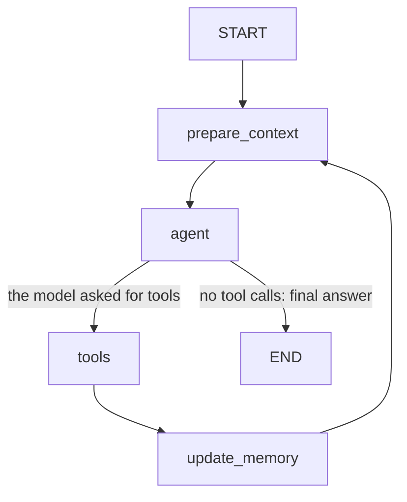

# EO scene agent

A conversational agent for exploring Sentinel-2 satellite imagery. Ask in plain language which scenes exist for a place and a period, with a cloud cover limit, then keep asking about the results (for example "details of the second one"). It is built with LangGraph, calls its tools through an MCP server that queries a public STAC catalogue and a geocoding API, and is served over HTTP with FastAPI. Answers are grounded in what the tools returned.

```
user ──HTTP──> FastAPI ──> LangGraph agent ──MCP over HTTP──> MCP server ──> Earth Search STAC (scenes)
                               │                                       └──> Open-Meteo (geocoding)
                               └──> open-weight model (Gemma, through Ollama)
```

## Contents

1. [Quick start](#1-quick-start)
2. [The graph](#2-the-graph)
3. [Context policy](#3-context-policy)
4. [Error behaviour](#4-error-behaviour)
5. [Traces](#5-traces)
6. [MCP tools](#6-mcp-tools)
7. [HTTP API](#7-http-api)
8. [Persistence](#8-persistence)
9. [Evaluation](#9-evaluation)
10. [Data sources and terms](#10-data-sources-and-terms)

## 1. Quick start

Python 3.11 or newer. Dependencies are pinned with exact versions in `pyproject.toml`.

**Install**

```bash
git clone https://github.com/Oenarion/EO_agent.git && cd EO_agent
python -m venv .venv
```

Activate the environment: `source .venv/bin/activate` (Linux, macOS) or `.venv\Scripts\Activate.ps1` (Windows PowerShell). Then:

```bash
pip install -e ".[dev]"
cp .env.example .env        # Windows: copy .env.example .env
```

**Model.** The agent uses an open-weight model through Ollama: `gemma4:31b-cloud`, a cloud-hosted model, so Ollama must be installed and you need to run `ollama signin` once. There is no API key. `.env.example` already has these values, so copying it to `.env` is enough. This is the only setup I have tested. The `.env` file is never committed.

**Run the tests** (offline, about 10 seconds, no model and no network):

```bash
python -m pytest -q
```

**Start the two processes**, each in its own terminal with the environment active:

```bash
python -m eo_agent.mcp_server.server
```

```bash
python -m uvicorn eo_agent.api.main:app --port 8000
```

The MCP server listens on `http://127.0.0.1:8001/mcp` (change it with `MCP_URL`). After any change to the tools, restart the MCP server: the agent reads the tool schemas when it first connects.

**Run the demo.** One session, three turns: a question that needs tools, a follow-up that relies on the previous answer, and a forced tool error. It then prints the trace so you can match it to the three replies.

```bash
python demo/run_demo.py
```

The trace is also in `traces/<session_id>.jsonl`, and you can print it again with `python -m eo_agent.observability.pretty <session_id>`.

**Chat with it.** An interactive client for the running API, with `/trace` and `/memory` commands:

```bash
python demo/chat.py
```

**Run the context demo.** A 15 turn conversation. It needs low thresholds in the API so that the policy triggers early, so restart the API like this:

```powershell
$env:MAX_WINDOW="4"; $env:SUMMARY_TRIGGER="8"; python -m uvicorn eo_agent.api.main:app --port 8000
```

```bash
MAX_WINDOW=4 SUMMARY_TRIGGER=8 python -m uvicorn eo_agent.api.main:app --port 8000
```

```bash
python demo/run_context_demo.py
```

**Example traces** (made with the model above) are in `traces/`:

| File | What it shows |
| --- | --- |
| `traces/normal.jsonl` | A normal run: a search over Ravenna and a follow-up question |
| `traces/error.jsonl` | The 3-turn demo, with the forced tool error in turn 3 |
| `traces/context_policy.jsonl` | The 15-turn run with `MAX_WINDOW=4`, `SUMMARY_TRIGGER=8`, including summaries |

## 2. The graph



- **`prepare_context`** applies the context policy (below) and builds the exact input for the model: system prompt, session memory block, the recent messages. It runs on every pass of the loop.
- **`agent`** calls the model with the three MCP tools bound. If the model returns tool calls, the graph goes to `tools`. If it returns text, that is the final answer and the graph ends.
- **`tools`** runs each requested tool through a real MCP client (`langchain-mcp-adapters`). Nothing is imported from the server: the agent only sees what the server publishes over HTTP. Any failure becomes an error message for the model (section 4).
- **`update_memory`** is plain code, with no model call. It reads the tool results of this pass and updates the working memory: the place, dates and cloud range of the last search, the numbered list of results, the selected scene.
- **Where the loop stops.** It ends when the model answers without tool calls. A safety limit, `MAX_STEPS` (default 6) tool passes per turn, also ends it: once reached, the model is called without tools and is told to answer with what it has and to say that it stopped.
- **Persistence of the conversation.** The graph is compiled with a checkpointer (`InMemorySaver`), and the `thread_id` is the API session id. See section 8 for what to use after a restart.

## 3. Context policy

A follow-up has to be able to depend on earlier turns without the user repeating anything. The policy has three parts.

**What is stored per session** (the checkpoint):
- the messages, with every tool message capped at `MAX_TOOL_CHARS` (4000) characters. The cap is applied after the working memory has read the full result;
- the **working memory**: place, date range, cloud filter, the numbered results of the latest search, the selected scene. Plain code keeps it up to date, so it is exact;
- a **summary** of older turns, written by the model, at most `SUMMARY_MAX_CHARS` (1200) characters.

**What is sent to the model on every call:**
- the system prompt, then a "session memory" block rendered from the working memory and the summary;
- only the last `MAX_WINDOW` (8) messages, extended backwards to the start of a turn, so a tool call is never separated from its result;
- tool results from earlier turns are replaced by one line, for example `search_scenes: 5 of 5 scenes returned for 2025-07-01..2025-07-31, cloud 0.0-10.0%`. The raw JSON is only sent in the turn that asked for it.

**How it is bounded.** When more than `SUMMARY_TRIGGER` (12) messages are stored, the oldest whole turns are folded into the summary with one short model call and removed from the state. The turn in progress is never touched. If the summary call fails, a deterministic template is used instead and the turn goes on. Tool outputs are also compact by design (the MCP tools never return raw STAC items). The history of raw tool payloads is therefore never unbounded.

Why such a reference still works after its messages are gone: the numbered list lives in the working memory, not in the history. Information about older searches survives in the summary.

Each model call records its size in the trace (`prepare_context` node events and `llm_call` events): messages stored, messages sent, characters sent, tokens when the provider reports them, and whether it summarized.

**Proof.** `demo/run_context_demo.py` ran 15 turns with `MAX_WINDOW=4`, `SUMMARY_TRIGGER=8` (trace: `traces/context_policy.jsonl`). Without the policy the history would have reached 52 messages. With it, the session ended with 4 stored messages, never had more than 9 stored at any model call, and made 8 summary calls. The last question, about the first search over Ravenna (whose results had been replaced in the working memory by three later searches), was answered correctly from the summary:

```
turn  state  sent  chars  removed  question
   1      1     5   5398        0  Find Sentinel-2 scenes over Ravenna, Italy in July 2025 ...
   ...
  12      9     3   4454        8  Details of the last one, please.
  15      9     3   3969        6  Going back to the very first search, over Ravenna: ...
```

`state` is the number of stored messages when the turn starts, `sent` the messages in the last model call of the turn, `removed` the messages folded into the summary during the turn.

Known limits: the summary is text written by a model, so it can be wrong; facts that must be exact are also in the working memory. When a new search replaces the working memory, the older results exist only in the summary. The window can exceed `MAX_WINDOW` when one turn has many tool calls.

## 4. Error behaviour

A failing tool never crashes the process, and the user always gets a reply that says what was attempted and that it failed.

1. A tool fails in one of two ways: the MCP server reports an error (`isError`: unknown scene id, bad date, bbox too large...), or the call itself raises (connection refused, timeout). The `tools` node catches both and gives the model a message with the tool name, the arguments and the cause. The turn continues.
2. The model writes the reply. The prompt asks for one or two sentences: what it tried, that it failed, why.
3. If the model returns an empty answer, a fixed template replaces it: `I tried to call <tool> with <arguments> and it failed: <reason>.`
4. The failure is logged at ERROR level with the session id, the tool, the arguments and the error, for example:
   `ERROR [session=error] eo_agent.agent: tool=get_scene_details args={"scene_id": "S2X_DOES_NOT_EXIST"} error=Error executing tool get_scene_details: [not_found] ...`
5. The API answers HTTP 200: the user got an answer. Only unexpected failures are 5xx (503 if the language model is unreachable, 500 for an internal bug). The API keeps running in all cases.
6. If the MCP server is down, the API still starts. Chats get a fixed reply that explains it, and the connection is retried on the next request, so restarting the MCP server is enough.

The MCP tools retry transient failures (timeout, 5xx) once. Validation and not-found errors are not retried. The agent itself does not retry.

`traces/error.jsonl` is the demo with the forced error: turn 3 asks for `S2X_DOES_NOT_EXIST`, the `tool_call` line has the error, and the reply explains it.

## 5. Traces

Every request writes JSON lines to `traces/<session_id>.jsonl`. All lines have the same fields:

`ts, session_id, turn, event, node, tool, args, duration_ms, error, result_summary, final_answer, data`

Events: `request_start`, `node` (each graph node), `llm_call` (including summary calls, with token counts), `tool_call` (arguments, duration, error), `request_end` (the final answer, identical to the API reply).

It is done with a LangChain callback handler attached to the graph run, plus a `contextvar` for the session id (the log lines get it from the same variable), so the node and tool code does not know about tracing. API keys are never written. `python -m eo_agent.observability.pretty <session_id>` prints a trace as a table grouped by turn, with the final answers.

## 6. MCP tools

The server (`src/eo_agent/mcp_server/`) uses FastMCP over streamable HTTP, as its own process. Tool outputs are typed (pydantic) and compact. Inputs are validated before any network call, and errors are typed: `invalid_input`, `not_found`, `upstream_error`.

| Tool | Inputs | External API | Returns |
| --- | --- | --- | --- |
| `geocode_place` | `name` | Open-Meteo geocoding | Up to 3 candidates (name, country, region, lat, lon, a bbox of about 10 km), most populous first. No match is an empty list, not an error |
| `search_scenes` | `bbox` `[west, south, east, north]`, `start_date`, `end_date` (YYYY-MM-DD), `max_cloud_cover` (20), `min_cloud_cover` (0), `limit` (5, max 10) | Earth Search STAC, collection `sentinel-2-l2a` | Numbered scenes (id, datetime, cloud cover, tile, thumbnail), clearest first, `total_found`, `more_available`, the query actually used. Each side of the bbox is limited to 2 degrees |
| `get_scene_details` | `scene_id` | Earth Search STAC | Datetime, cloud cover, tile, satellite, sun elevation, footprint, thumbnail, band names. Unknown id gives `not_found` |

Each result also lists fields the API did not provide (`missing_fields`, `missing_data`), and the agent reports them at the end of its answer.

## 7. HTTP API

| Endpoint | Purpose |
| --- | --- |
| `POST /chat` | Body `{"session_id": "...", "message": "..."}`. Returns `{session_id, reply, turn, tool_calls: [{tool, args, ok}]}` |
| `GET /traces/{session_id}` | The trace events of a session |
| `GET /sessions/{session_id}/memory` | The working memory, the summary and the number of stored messages |
| `GET /health` | Status, whether the tools are loaded, the model, the context thresholds |

The session id may contain letters, digits, `_`, `.` and `-` (up to 64 characters), because it is also a file name. Interactive docs: `http://127.0.0.1:8000/docs`.

## 8. Persistence

Sessions are kept in memory (`InMemorySaver`), so they are lost when the API process restarts. The trace files stay on disk. To survive a restart I would swap in a persistent LangGraph checkpointer: `SqliteSaver` (package `langgraph-checkpoint-sqlite`) for a single process, or `PostgresSaver` (`langgraph-checkpoint-postgres`) for several processes. It is a change in `AgentRuntime` and one dependency, with the `thread_id` unchanged. I did not do it because in-memory is enough here, and a database adds setup for whoever runs the project. The turn counter would then move into the graph state.

## 9. Evaluation

`evals/` has a small evaluation: 15 scripted questions (one to three turns each, a fresh session per case), checked by plain code. No model judges anything. The agent runs in the same process with the real model and the real MCP tools, so the MCP server must be running.

```bash
python -m evals.run_eval --repeat 3
```

Every case gets three generic checks: the session does not crash, every scene id in a reply appears in a tool result of that session (nothing invented), and a failed tool is reported in the reply. Each case adds its own: the right tool was called with the right arguments (for example, details requested for the second scene of the previous search), a value is taken from memory without calling a tool, an empty search is reported as empty, a place that does not exist is not searched, an ambiguous place is named, an unknown scene id produces a failure that the reply explains, a missing field is declared, and a question outside the scope is not answered from the model's own knowledge. The checks are themselves tested offline in `tests/test_eval_checks.py`.

Result of the last run (`evals/last_run.json`), model `gemma4:31b-cloud`, 3 runs of each case:

| | Passed |
| --- | --- |
| Cases | 45 / 45 |
| Checks | 222 / 222 |
| Groundedness | 60 / 60 |
| Tool use | 63 / 63 |
| Memory (follow-ups) | 21 / 21 |
| Empty and unknown results | 15 / 15 |
| Invalid input and tool errors | 54 / 54 |
| Disclosure (place used, missing data) | 9 / 9 |

How to read this number: the first runs were not perfect (42 of 45 cases), and they found two gaps in the system prompt, which I then fixed: the agent answered a general knowledge question from its own knowledge, and in one run it silently changed an impossible date. I tuned the prompt on these same 15 questions, so the final score is not an independent test. It is a small regression suite that shows the behaviour holds, and it should grow with new questions. It covers one model and 3 runs per case, and the model is not deterministic, so a single failing run is not unusual.

## 10. Data sources and terms

- Scenes: Sentinel-2 L2A from the [Earth Search](https://earth-search.aws.element84.com/v1) STAC API by Element 84. Sentinel data are free and open under the Copernicus Sentinel data legal notice. No key is needed.
- Geocoding: [Open-Meteo](https://open-meteo.com/) geocoding API, licensed CC BY 4.0. The free tier is for non-commercial use, which covers this project. Attribution: geocoding data by Open-Meteo.com.
- Both are called with a custom User-Agent, timeouts, and at most one retry.
